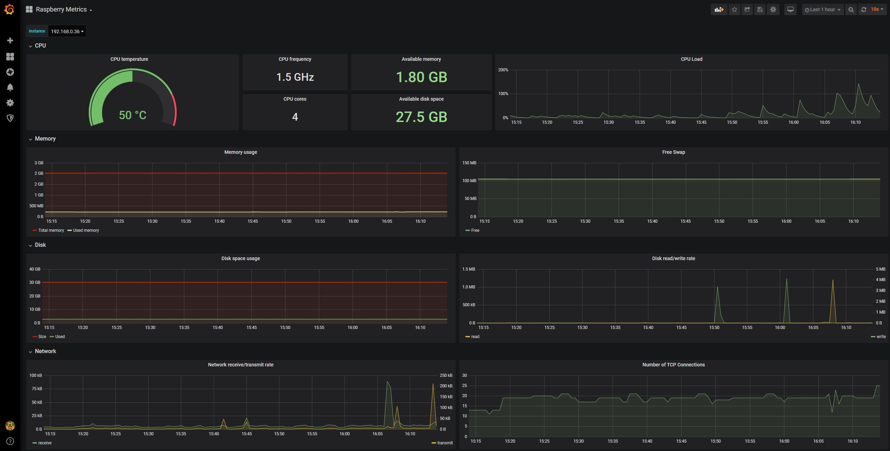

Raspberry metrics
=================

Expose raspberry PI metrics using [Grafana](https://grafana.com/) and [Prometheus](https://prometheus.io/):



## About ##

This project contains [Ansible](https://www.ansible.com/) playbook which installs three services on Raspberry:

* [Node exporter](https://github.com/prometheus/node_exporter) - expose Raspberry metrics (v0.14.0)
* [Prometheus](https://prometheus.io/) - collect and store metrics (v1.7.1)
* [Grafana](https://grafana.com/) - metrics visualization (v4.3.2)


### Prerequisites ###

* Raspberry PI with ARMv7 processor (Tested on [Raspberry PI 2 Model B](https://www.raspberrypi.org/products/raspberry-pi-2-model-b/))
* Debian installed on Raspberry (like [Raspbian Jessie](https://www.raspberrypi.org/downloads/raspbian/))
* open port 22 on raspberry (SSH)
* open port 3000 on raspberry (Grafana)

## How to install ##

[Ansible](https://www.ansible.com/) is required for installation.

If you don't have Ansible installed, see [Ansible installation](http://docs.ansible.com/ansible/intro_installation.html).

### 1. Configure Raspberry IP address ###

Checkout project.

Edit file **ansible/hosts** and set Raspberry IP address.

### 2. Run ansible playbook ###

Run Ansible playbook with password authentication:
```
    cd ansible/
    ansible-playbook raspberry.yml -i hosts -u pi -k -K
```

Run Ansible playbook with SSH keys authentication:

```
    cd ansible/
    ansible-playbook raspberry.yml -i hosts -u pi
```

### 3. Configure Grafana datasource ###

* Go to Grafana URL http://raspberry:3000/
* login with admin/admin
* add new Data Source:


* Click on "Raspberry metrics" dashboard:


That's it.
